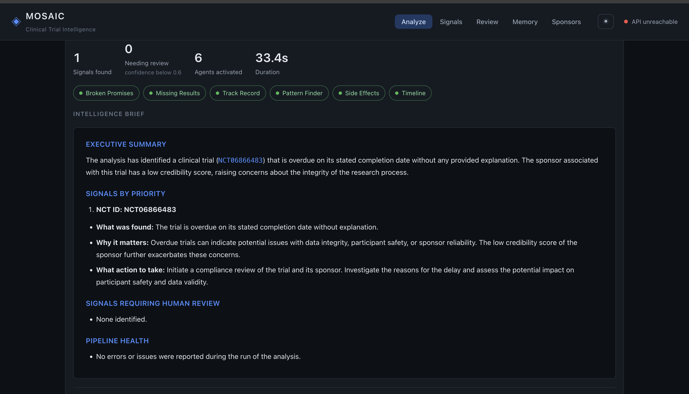

# MOSAIC : Multi-Agent Clinical Trial Intelligence

> A multi-agent AI system that detects research integrity signals across
> clinical trials using 6 specialist agents running in parallel, with a
> React console served straight off the FastAPI backend.



[](https://python.org)
[](https://fastapi.tiangolo.com)
[](https://langchain-ai.github.io/langgraph)
[](https://react.dev)
[](https://www.docker.com)

---

## Table of Contents

- [Project Description](#project-description)
- [Features](#features)
- [Tech Stack](#tech-stack)
- [Architecture](#architecture)
- [Project Structure](#project-structure)
- [Getting Started](#getting-started)
- [Environment Variables](#environment-variables)
- [Running](#running)
- [Console](#console)
- [Usage](#usage)
- [API Documentation](#api-documentation)
- [Deployment](#deployment)
- [Roadmap](#roadmap)

---

## Project Description

MOSAIC ingests clinical trial data from ClinicalTrials.gov and PubMed,
reasons across studies with six parallel agents, detects research integrity
signals, and exposes both a FastAPI REST layer and a React console over it.

**The problem it solves:** a large share of completed clinical trials never
publish their results, outcomes get quietly redefined mid-study, and safety
discrepancies sit buried across hundreds of thousands of public records that
no single reviewer can read simultaneously. MOSAIC reads across all of them
at once and surfaces what a manual review would miss.

**What makes it different:**

- 6 specialist agents run **in parallel**, not sequentially
- **Three types of memory** — episodic, procedural, semantic
- **Learns from human feedback** — a reviewer's rejection updates agent
  reasoning permanently, not just for that one run
- One process, one port — the React console is served directly by FastAPI,
  no separate frontend server or CORS setup

---

## Features

### 6 Specialist Agents Running in Parallel

| Agent               | What it detects                                      | Review threshold |
| ------------------- | ---------------------------------------------------- | ---------------- |
| Missing Results     | Completed trials with no results posted              | 0.65             |
| Broken Promises     | Outcome switching — goals changed mid-study          | 0.60             |
| Track Record        | Sponsor credibility built up over time               | 0.70             |
| Pattern Finder      | Cross-study patterns invisible to single-study reads | 0.65             |
| Side Effect Checker | Safety gaps between filings and published papers     | 0.55             |
| Timeline Analyst    | Silent delays past completion date                   | 0.60             |

A signal below its agent's threshold goes to the human review queue instead
of being saved directly.

### Three-Layer Memory System

- **Episodic** : agents remember what they found in past sessions
- **Procedural** : agents learn from human corrections permanently
- **Semantic** : a sponsor knowledge base that grows with every run

### Human-in-the-Loop Gate

- Low-confidence signals go to a review queue instead of being saved outright
- A reviewer's rejection is written back to procedural memory, so the same
  mistake isn't repeated in future runs
- One correction changes agent behaviour in every future session, not just
  the current one

---

## Tech Stack

| Layer               | Technology                                                 |
| ------------------- | ---------------------------------------------------------- |
| Language            | Python 3.12, async                                         |
| Agent Framework     | LangGraph + LangChain                                      |
| Agent Memory        | LangMem                                                    |
| LLM / Embeddings    | OpenAI                                                     |
| Tracing             | LangSmith                                                  |
| API                 | FastAPI + Uvicorn                                          |
| Frontend            | React + Vite (TypeScript), served by FastAPI in production |
| Database            | PostgreSQL + pgvector (Neon, serverless)                   |
| Object Storage      | Backblaze B2 (S3-compatible, via boto3)                    |
| Async DB Driver     | asyncpg + SQLAlchemy (async)                               |
| Retry Logic         | tenacity                                                   |
| Validation          | Pydantic v2                                                |
| Logging             | structlog                                                  |
| Containerization    | Docker (multi-stage build)                                 |
| Reverse Proxy / TLS | Traefik (Docker labels, Let's Encrypt)                     |

---

## Architecture

```text
DATA SOURCES
├── ClinicalTrials.gov API v2   (studies, free, no auth)
└── PubMed eUtils API           (research papers, free, no auth)
        │
        ▼
INGESTION LAYER (ingestion/)
├── clinical_trials_client.py   (async, rate limited, retry)
├── pubmed_client.py            (esearch → efetch, XML parse)
├── document_parser.py          (raw JSON → Pydantic models)
└── backblaze_store.py          (save raw + processed to B2)
        │
        ▼
PROCESSING LAYER (processing/)
├── chunker.py                  (word-based chunks with overlap)
├── embedder.py                 (OpenAI embeddings, batched)
└── vector_store.py             (asyncpg + pgvector cosine search)
        │
        ▼
MEMORY LAYER (memory/, via LangMem)
├── episodic_store.py           (past sessions, semantic search)
├── procedural_store.py         (reasoning rules + HITL learning)
└── semantic_store.py           (sponsor credibility profiles)
        │
        ▼
AGENT GRAPH (graph/, LangGraph — parallel execution)
├── Supervisor                  (routes + compiles the final brief)
├── Missing Results Agent
├── Broken Promises Agent
├── Track Record Agent
├── Pattern Finder Agent
├── Side Effect Checker Agent
└── Timeline Analyst Agent
        │
        ▼
HITL GATE (graph/hitl.py)
├── Confidence ≥ threshold → signals table (direct save)
└── Confidence < threshold → review queue → human decision → procedural memory
        │
        ▼
FASTAPI (api/) ── serves REST endpoints + the compiled React console
```

## Project Structure

```text
mosaic/
├── config/
│   ├── settings.py             # Pydantic BaseSettings, all env vars
│   └── logging_config.py       # Centralised logging setup
│
├── ingestion/
│   ├── clinical_trials_client.py
│   ├── pubmed_client.py
│   ├── document_parser.py
│   ├── backblaze_store.py
│   └── run_ingestion.py        # Entry point — run this first
│
├── processing/
│   ├── chunker.py
│   ├── embedder.py
│   ├── vector_store.py
│   └── run_processing.py       # Entry point — run this second
│
├── memory/
│   ├── episodic_store.py
│   ├── procedural_store.py
│   └── semantic_store.py
│
├── agents/
│   ├── supervisor.py
│   ├── broken_promises_agent.py
│   ├── missing_results_agent.py
│   ├── track_record_agent.py
│   ├── pattern_finder_agent.py
│   ├── side_effect_agent.py
│   └── timeline_agent.py
│
├── tools/
│   ├── search_tools.py         # database + memory tools
│   ├── clinical_tools.py       # live ClinicalTrials.gov tools
│   └── pubmed_tools.py         # live PubMed tools
│
├── graph/
│   ├── state.py                # MosaicState TypedDict
│   ├── graph_builder.py        # wires all agents into LangGraph
│   └── hitl.py                 # HITL gate + procedural learning loop
│
├── api/
│   ├── main.py                 # FastAPI app + lifespan
│   ├── schemas.py               # all Pydantic request/response models
│   ├── dependencies.py         # shared resource singletons
│   ├── static.py               # mounts the compiled React console
│   └── routers/
│       ├── analysis.py         # POST /api/v1/analyze
│       ├── signals.py          # GET /api/v1/signals
│       ├── review.py           # GET + PATCH /api/v1/review
│       └── memory.py           # GET /api/v1/memory + /sponsors
│
├── frontend/                   # React + Vite console
│   └── src/
│       ├── components/         # tab views (Analyze, Signals, Review, Memory, Sponsors)
│       ├── api.ts              # fetch wrapper for the backend
│       ├── theme.ts            # light/dark theme handling
│       └── App.tsx
│
├── deployment/
│   ├── Dockerfile              # multi-stage: frontend build → backend → runtime
│   ├── docker-compose.yml      # joins an existing Traefik network
│   └── deploy.sh               # build, start, wait for healthy
│
├── .dockerignore                # MUST live at repo root — see file header
├── .env.example                 # template — copy to .env and fill in
├── pyproject.toml               # pip install -e . for clean imports
├── requirements.txt
└── README.md
```

---

## Getting Started

### Prerequisites

- Python 3.12+
- Node.js 20+ (for the frontend)
- A Neon Postgres project (or any Postgres 15+ with the `pgvector` extension)
- A Backblaze B2 bucket (S3-compatible)
- An OpenAI API key

### 1. Clone the repository

```bash
git clone https://github.com/ayushagarwal27/mosaic-agentic-clinical-trial.git
cd mosaic-agentic-clinical-trial
```

### 2. Create a virtual environment and install dependencies

```bash
python3 -m venv .venv
source .venv/bin/activate
pip install -r requirements.txt
pip install -e .
```

### 3. Configure environment variables

```bash
cp .env.example .env
# fill in OpenAI, Neon, Backblaze B2, and LangSmith values — see below
```

### 4. Run the ingestion and processing pipelines

```bash
python3 ingestion/run_ingestion.py
# downloads studies from ClinicalTrials.gov and PubMed → saves to B2

python3 processing/run_processing.py
# chunks studies, generates embeddings, saves to Postgres/pgvector
```

### 5. Run the app — see [Running](#running) below

---

## Environment Variables

Copy `.env.example` to `.env` and fill in every value:

```env
# LLM
OPENAI_API_KEY=
EMBEDDING_MODEL=
OPENAI_CHAT_MODEL=

# Tracing
LANGSMITH_API_KEY=
LANGSMITH_PROJECT=
LANGSMITH_TRACING_V2=

# Object storage (Backblaze B2)
B2_KEY_ID=
B2_APPLICATION_KEY=
B2_BUCKET_NAME=
B2_ENDPOINT_URL=

# Database (Neon)
DB_HOST=
DB_PORT=
DB_NAME=
DB_USER=
DB_PASSWORD=
DB_SSL=true

# DataSource
CLINICAL_TRIALS_BASE_URL=
CLINICAL_TRIALS_PAGE_SIZE=
PUBMED_BASE_URL=

# Server
API_HOST=0.0.0.0
API_PORT=8000
API_ENV=development
```

---

## Running

### Production-style — one server, one port

The API serves the compiled React console from the same process, so there
is nothing to deploy separately and no CORS to configure.

```bash
cd frontend && npm install && npm run build && cd ..
uvicorn api.main:app --reload
```

Then open http://127.0.0.1:8000 — the console is at `/`, the API stays at
`/api/v1/*`, and Swagger is at `/docs`.

If `frontend/dist` has not been built, the API still starts normally and
`/` returns a JSON descriptor instead of the console.

### Frontend development — hot reload

```bash
uvicorn api.main:app --reload     # terminal 1
cd frontend && npm run dev        # terminal 2 → http://localhost:5173
```

Vite proxies `/api` to uvicorn on port 8000, so the dev server talks to the
real backend and no environment variable needs setting.

---

## Console

| Tab      | Endpoint(s)                                                            |
| -------- | ---------------------------------------------------------------------- |
| Analyze  | `POST /api/v1/analyze`                                                 |
| Signals  | `GET /api/v1/signals`, `GET /api/v1/signals/{id}`                      |
| Review   | `GET /api/v1/review/queue`, `PATCH /api/v1/review/{queue_id}`          |
| Memory   | `GET /api/v1/memory/episodes`, `GET /api/v1/memory/procedures/{agent}` |
| Sponsors | `GET /api/v1/sponsors`, `GET /api/v1/sponsors/{name}`                  |

An analysis run fans out six agents in parallel and takes minutes, so the
Analyze tab shows an elapsed timer rather than a progress bar — the endpoint
does not stream.

---

## Usage

### Run an analysis

```bash
curl -s -X POST \
  -H "Content-Type: application/json" \
  -d '{"task": "Find completed trials with missing results", "max_studies": 5}' \
  http://localhost:8000/api/v1/analyze | python3 -m json.tool
```

### Check the review queue

```bash
curl -s http://localhost:8000/api/v1/review/queue | python3 -m json.tool
```

### Submit a human review decision

```bash
curl -s -X PATCH \
  -H "Content-Type: application/json" \
  -d '{"decision": "reject", "reviewer": "analyst@company.com", "rejection_reason": "Trial was terminated early — exempt from posting requirement"}' \
  http://localhost:8000/api/v1/review/QUEUE_ID_HERE | python3 -m json.tool
```

### Search agent memory

```bash
curl -s "http://localhost:8000/api/v1/memory/episodes?query=missing+results+sponsor" | python3 -m json.tool
```

### View agent reasoning rules

```bash
curl -s http://localhost:8000/api/v1/memory/procedures/missing_results_agent | python3 -m json.tool
```

---

## API Documentation

| Method  | Endpoint                                 | Description                            |
| ------- | ---------------------------------------- | -------------------------------------- |
| `POST`  | `/api/v1/analyze`                        | Trigger a full analysis run            |
| `GET`   | `/api/v1/signals`                        | List all generated signals             |
| `GET`   | `/api/v1/signals/{id}`                   | Get one signal by ID                   |
| `GET`   | `/api/v1/review/queue`                   | Get pending human review items         |
| `PATCH` | `/api/v1/review/{queue_id}`              | Submit an approve/reject/edit decision |
| `GET`   | `/api/v1/memory/episodes`                | Search past agent sessions             |
| `GET`   | `/api/v1/memory/procedures/{agent_name}` | Get an agent's reasoning rules         |
| `GET`   | `/api/v1/sponsors`                       | List all sponsor profiles              |
| `GET`   | `/api/v1/sponsors/{name}`                | Get one sponsor's credibility profile  |
| `GET`   | `/api/v1/health`                         | System health check                    |

Full interactive documentation is available at `/docs` (Swagger UI) when the
API is running.

---

## Deployment

MOSAIC ships as a single multi-stage Docker image (`deployment/Dockerfile`)
containing the API and the compiled React console — no separate frontend
container. Postgres (Neon) and object storage (Backblaze B2) are both
external managed services reached over the network, so nothing else needs
to run alongside it.

`deployment/docker-compose.yml` is written to join an **existing** Traefik
reverse proxy on the host via an external Docker network, rather than
publishing a port or running a second reverse proxy — useful when MOSAIC is
one of several apps on the same VPS.

```bash
cp .env.example .env
# fill in real OpenAI / B2 / Neon / LangSmith values

./deployment/deploy.sh
```

The script checks that `.env` exists and that the expected Docker network is
present, builds the image, starts the container, and polls the built-in
`HEALTHCHECK` until it reports healthy. See the header comments in
`deployment/docker-compose.yml` and `deployment/deploy.sh` for the exact
network name, hostname, and TLS cert resolver this deployment is wired to —
update them to match your own reverse proxy setup if it differs.

---

## Roadmap

- [ ] Add an evaluation layer with LangSmith evals
- [ ] Add the FDA adverse event database as a third data source
- [ ] Implement scheduled runs
- [ ] Add alerts when high-confidence signals are generated
- [ ] Add support for international trial registries (EudraCT, ISRCTN)
